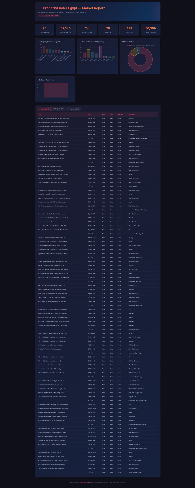

# 🏠 PropertyFinder Egypt — Selenium Web Scraper

### CSE476s (UG2018) — Fundamentals of Big-Data Analytics



## 👥 Team Members

| Name | ID |
|------|------|
| Michael George | 2100709 |
| Kareem Mousa | 2100295 |
| George Joseph Basilious | 2100261 |

---

## 🎯 Problem Description

The Egyptian real estate market is highly dynamic and rapidly expanding. However, acquiring structured, reliable, and up-to-date property data for market analysis, pricing strategies, and investment decisions is challenging. Manual data collection from real estate portals is error-prone, time-consuming, and unscalable, hindering the ability of analysts, investors, and developers to make data-driven decisions effectively.

---

## 💼 Business and Market Benefits

Automating data collection from major real estate platforms like PropertyFinder provides significant business value:
- **Market Intelligence:** Enables real-time trend analysis, price tracking, and demand forecasting across different locations.
- **Competitive Advantage:** Allows brokerages and agencies to benchmark their listings and performance against competitors.
- **Investment Insights:** Empowers investors to identify high-yield areas and undervalued properties.
- **Operational Efficiency:** Eliminates thousands of hours of manual research, transforming raw web data into actionable, structured formats instantly.

---

## 🛠 Technical Description

A robust, production-ready web scraper built with **Selenium** and **Python**. Instead of relying on brittle DOM scraping, it intercepts and extracts the underlying Next.js `__NEXT_DATA__` JSON payloads and JSON-LD structured metadata directly from the page source. 
This approach ensures high-fidelity data extraction that is fast, reliable, and resilient to frequent UI modifications. The pipeline processes this raw data using Pandas, normalizing and deduplicating it before exporting it into ready-to-use formats (JSON, Excel) and generating interactive HTML analytics dashboards.

---

## 📊 Results

The scraper successfully automates the extraction of comprehensive datasets, including:
- **Rental/Sale Listings:** Complete with pricing, amenities, coordinates, and images.
- **Off-Plan Projects:** Developer details, delivery dates, and price ranges.
- **Broker Agencies:** Company metrics and contact details.

It automatically generates an interactive HTML dashboard that visualizes price distributions, location-based property counts, and provides searchable data tables, demonstrating a complete end-to-end big data collection and reporting pipeline.


---

## 🔗 Link to Public Project Repository

[📁 Public Project Repository (Data, Code, Demo Video)](https://github.com/the3miaphysite3engineer3/BigDataProject)

---

## 📋 Table of Contents

- [Team Members](#-team-members)
- [Problem Description](#-problem-description)
- [Business and Market Benefits](#-business-and-market-benefits)
- [Technical Description](#-technical-description)
- [Results](#-results)
- [Link to Public Project Repository](#-link-to-public-project-repository)
- [Features](#-features)
- [Architecture](#-architecture)
- [Prerequisites](#-prerequisites)
- [Installation](#-installation)
- [Usage](#-usage)
- [Output Files](#-output-files)
- [Report Generation](#-report-generation)
- [Project Structure](#-project-structure)
- [Configuration](#-configuration)
- [Troubleshooting](#-troubleshooting)

---

## ✨ Features

| Feature | Description |
|---------|-------------|
| **Rental Listings** | Scrapes apartment listings across multiple pages (title, price, bedrooms, bathrooms, size, location, coordinates, images) |
| **Off-Plan Projects** | Extracts new/off-plan development projects (developer, status, price range, delivery date, property types) |
| **Broker Agencies** | Collects brokerage company data (agent count, listings breakdown, contact info, license numbers) |
| **Dual Extraction** | Primary: `__NEXT_DATA__` JSON payload · Fallback: JSON-LD structured data |
| **Multi-format Export** | Outputs to JSON, Excel (`.xlsx`), and interactive HTML report |
| **HTML Report** | Auto-generates a beautiful, interactive dashboard with charts and data tables |
| **Headless Mode** | Runs in headless Chrome by default — no GUI required |

---

## 🏗 Architecture

```
PropertyFinder.eg (Next.js SSR)
        │
        ▼
┌──────────────────────────┐
│   Selenium (Headless)    │   Loads the page, waits for render
│   Chrome WebDriver       │
└──────────┬───────────────┘
           │
           ▼
┌──────────────────────────┐
│   __NEXT_DATA__ <script> │   Extracts the hydration JSON payload
│   JSON-LD <script>       │   (contains ALL listing data server-side)
└──────────┬───────────────┘
           │
           ▼
┌──────────────────────────┐
│   Python Data Pipeline   │   Parses, normalizes, deduplicates
│   pandas + json          │
└──────────┬───────────────┘
           │
     ┌─────┼─────┐
     ▼     ▼     ▼
   .json  .xlsx  .html
```

> **Why `__NEXT_DATA__`?**  PropertyFinder uses Next.js with SSR. The entire page payload (listings, projects, agencies) is embedded in a `<script id="__NEXT_DATA__">` tag, pre-rendered on the server. This makes extraction **faster and more reliable** than DOM scraping — no need to wait for React hydration or deal with dynamic CSS selectors.

---

## 🔧 Prerequisites

- **Python** 3.8+
- **Google Chrome** (or Chromium) installed
- **ChromeDriver** matching your Chrome version (auto-managed via `webdriver-manager`)

---

## 📦 Installation

```bash
# Clone or navigate to the project
cd BigDataProject

# Create a virtual environment (recommended)
python3 -m venv .venv
source .venv/bin/activate

# Install dependencies
pip install selenium webdriver-manager pandas openpyxl
```

---

## 🚀 Usage

### Run the full scraper

```bash
python3 propertyfinder_scraper.py
```

This will:
1. Scrape **90 rental listings** (3 pages × 30 per page)
2. Attempt JSON-LD extraction (fallback method)
3. Scrape **24 off-plan projects**
4. Scrape **20 broker agencies**
5. Generate an **interactive HTML report**
6. Save all data to JSON, Excel, and HTML files

### Run only the report generator (from existing JSON files)

```bash
python3 propertyfinder_scraper.py --report-only
```

### Customize number of pages

Edit the `PAGES_TO_SCRAPE` variable in the `__main__` block:

```python
PAGES_TO_SCRAPE = 5  # scrapes 5 pages × ~30 listings = ~150 listings
```

---

## 📁 Output Files

| File | Description |
|------|-------------|
| `propertyfinder_selenium_listings.json` | All rental listings in JSON format |
| `propertyfinder_selenium_listings.xlsx` | Same listings in Excel format |
| `propertyfinder_selenium_projects.json` | Off-plan projects data |
| `propertyfinder_selenium_agencies.json` | Broker agency data |
| `propertyfinder_report.html` | Interactive HTML dashboard report |

---

## 📊 Report Generation

The scraper automatically generates a **self-contained HTML report** (`propertyfinder_report.html`) featuring:

- **Summary dashboard** with key metrics (total listings, avg price, top locations)
- **Price distribution chart** (histogram)
- **Listings by location** (bar chart)
- **Sortable data tables** for listings, projects, and agencies
- **Responsive design** — works on desktop and mobile
- **Dark theme** with modern UI

The report is generated from the JSON output files and requires no external dependencies to view — just open it in any browser.

---

## 📂 Project Structure

```
BigDataProject/
├── propertyfinder_scraper.py          # Main scraper + report generator
├── README.md                          # This file
├── propertyfinder_selenium_listings.json
├── propertyfinder_selenium_listings.xlsx
├── propertyfinder_selenium_projects.json
├── propertyfinder_selenium_agencies.json
├── propertyfinder_report.html         # Generated HTML report
└── .venv/                             # Python virtual environment
```

---

## ⚙ Configuration

| Parameter | Default | Description |
|-----------|---------|-------------|
| `headless` | `True` | Run Chrome without a visible window |
| `PAGES_TO_SCRAPE` | `3` | Number of listing pages to scrape |
| `window-size` | `1920x1080` | Browser viewport size |
| `user-agent` | Chrome 120 | Custom user agent string |

---

## 🔍 Troubleshooting

| Issue | Solution |
|-------|----------|
| `ModuleNotFoundError: selenium` | Run `pip install selenium webdriver-manager` |
| `ChromeDriver version mismatch` | Update Chrome or run `pip install -U webdriver-manager` |
| `No __NEXT_DATA__ found` | PropertyFinder may have changed their rendering; check if the page loads in a browser |
| `0 listings scraped` | The site may be rate-limiting; increase `time.sleep()` delays |
| `Agencies crash: 'str' has no get` | Ensure you have the latest version of the scraper (fixed in v2) |

---

## 📝 License

This project is for **educational and research purposes only**. Scraping should comply with the website's Terms of Service and `robots.txt`. Use responsibly.
